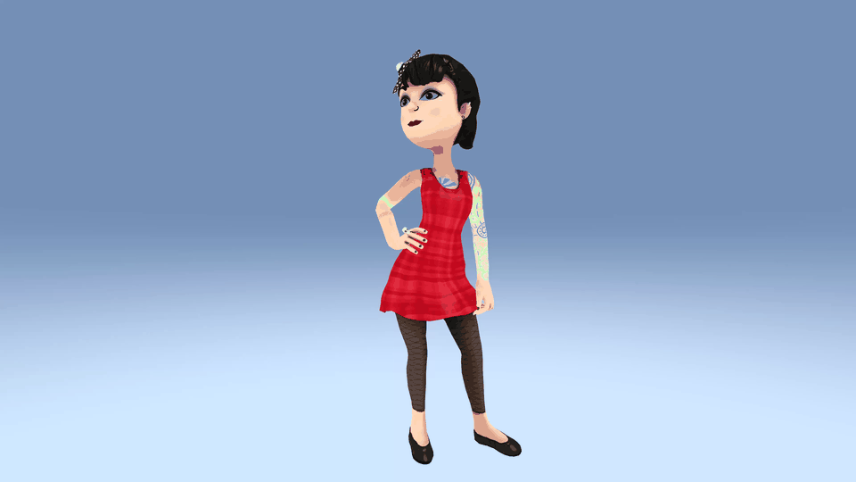
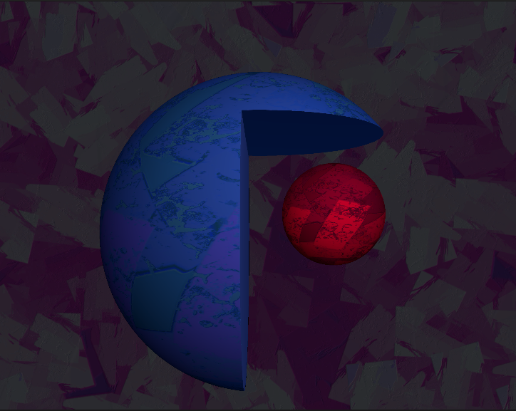

# Unity Shader Collection

A comprehensive collection of custom shaders and visual effects for Unity, featuring advanced rendering techniques including raymarching, subsurface scattering, post-processing effects, and more.

## 📋 Table of Contents

- [Overview](#overview)
- [Project Structure](#project-structure)
- [Shader Effects](#shader-effects)
- [Installation](#installation)
- [Usage](#usage)
- [Technical Details](#technical-details)

## Overview

This project contains a diverse set of custom shaders implemented in Unity's ShaderLab/CG/HLSL, covering various rendering techniques from basic unlit shaders to advanced effects like raymarching and subsurface scattering. Each shader is designed for specific visual effects and can be easily integrated into Unity projects.

## Project Structure

```
UnityShader/
├── Assets/
│   ├── Shaders/          # All shader files (.shader, .cginc)
│   ├── Scripts/          # C# scripts supporting shaders
│   ├── Materials/        # Material presets
│   ├── Scenes/           # Example scenes
│   └── ...
├── GIF/                  # Visual demonstrations of each effect
└── README.md
```

## Shader Effects

Below are detailed descriptions of each shader effect, with corresponding GIF demonstrations:

### 🎨 Alpha Draw Shader


**Description:** An alpha-based drawing shader that allows for dynamic mask creation and drawing effects. This shader is useful for creating interactive drawing or painting effects, mask-based animations, and UI elements with custom alpha blending.

**Shader File:** `Assets/Shaders/AlphaDrawShader.shader`

**Features:**
- Dynamic alpha mask manipulation
- Custom blending modes
- Real-time drawing capabilities

---

### 🔀 View Blend Shader


**Description:** A view-dependent blending shader that creates color transitions based on viewing angle. The shader blends between different color masks or textures depending on the camera's perspective relative to the surface, creating dynamic color-shifting effects.

**Shader File:** `Assets/Shaders/ViewBlendShader.shader` / `Assets/Shaders/ColorMaskBlendShader.shader`

**Features:**
- View-angle dependent blending
- Multiple color mask support
- Smooth transitions between states

---

### 🎭 Depth Post Effect


**Description:** A post-processing effect that uses depth information from the camera to create stylized depth-based visuals. This effect transforms the scene's depth buffer into artistic visualizations, commonly used for toon shading, depth fog, or depth-based outlines.

**Shader File:** `Assets/Shaders/DepthToonShader.shader`

**Features:**
- Depth buffer sampling
- Customizable depth visualization
- Post-processing pipeline integration

---

### 💥 Dissolve Effect


**Description:** A dissolve effect that gradually erases objects using a noise texture or pattern. The shader supports animated dissolution with customizable edges and glowing dissolve lines, perfect for teleportation effects, object destruction, or magical transitions.

**Shader File:** `Assets/Shaders/ToonShader.shader` (includes dissolve feature)

**Features:**
- Animated dissolve progression
- Customizable dissolve texture/pattern
- Glowing edge effects with HDR colors
- Auto-dissolve option for automatic animation

---

### ✨ Glowing Emission


**Description:** A high-dynamic-range (HDR) emission shader that creates bright, glowing effects on surfaces. This shader allows materials to emit light beyond the standard color range, creating eye-catching glow effects suitable for neon signs, magical objects, and sci-fi elements.

**Shader File:** `Assets/Shaders/StandardBasic.shader` / `Assets/Shaders/ToonShader.shader`

**Features:**
- HDR emission colors
- Emission texture support
- Intensity control
- Bloom-friendly output

---

### 🌈 Gradient Background


**Description:** A gradient skybox shader that creates smooth color transitions across the scene's background. This shader generates procedural gradient skies that can be animated and customized, providing an alternative to texture-based skyboxes.

**Shader File:** `Assets/Shaders/GradientSkyboxShader.shader`

**Features:**
- Smooth color gradients
- Animated gradient transitions
- Customizable color stops
- Skybox integration

---

### 📝 Outline Shader



**Description:** A toon-style outline shader that adds a configurable border around objects. The shader expands the mesh geometry outward to create clean, consistent outlines that maintain uniform thickness regardless of viewing angle, essential for cel-shaded and cartoon-style rendering.

**Shader File:** `Assets/Shaders/ToonShader.shader` (includes outline pass)

**Features:**
- Adjustable outline width
- Uniform outline thickness
- Color customization
- Works with both solid and transparent objects

---

### 🏔️ Parallax Mapping


**Description:** A parallax occlusion mapping shader that simulates depth and detail on flat surfaces using height information. This technique creates the illusion of 3D surface detail without additional geometry, making textures appear to have depth and relief.

**Shader File:** Embedded in various surface shaders

**Features:**
- Height-based parallax displacement
- Self-shadowing simulation
- Normal map integration
- Performance-optimized

---

### 🎨 PBR Color Split


**Description:** A chromatic aberration effect shader that separates RGB channels with customizable offsets. This creates a prismatic, glitch-like effect by shifting red, green, and blue channels independently, popular in stylized rendering and screen-space effects.

**Shader File:** `Assets/Shaders/ColorSplitShader.shader`

**Features:**
- Independent RGB channel offsets
- Vector-based offset control
- Post-processing compatible
- Real-time adjustment

---

### 🔊 Pulse Audio Shader


**Description:** An audio-reactive shader that responds to sound input, creating pulsing visual effects synchronized with audio. The shader samples audio data (typically RMS or frequency bands) to drive visual parameters like radius, intensity, or color, creating dynamic music visualization effects.

**Shader File:** `Assets/Shaders/AudioPulseShader.shader`

**Supporting Script:** `Assets/Scripts/AudioPulse.cs`

**Features:**
- Real-time audio analysis
- Global audio parameter sharing
- Smooth radius transitions
- Background and foreground color blending

---

### 💎 Reflection Shader


**Description:** A glass-like reflection shader that simulates realistic or stylized reflections. This shader uses grab pass or reflection probes to create mirror-like or distorted reflective surfaces, perfect for water, glass, and metallic materials.

**Shader File:** `Assets/Shaders/GlassShader.shader`

**Features:**
- Screen-space reflections (via GrabPass)
- Distortion effects
- Rim lighting
- Customizable gloss and specular highlights

---

### 💡 Rim Light


**Description:** A rim lighting effect that highlights object edges based on viewing angle. This shader calculates the angle between the view direction and surface normal to create bright edges, commonly used for toon shading, magical effects, and emphasizing object silhouettes.

**Shader File:** `Assets/Shaders/StandardBasic.shader` / `Assets/Shaders/ToonShader.shader`

**Features:**
- View-dependent rim calculation
- Adjustable rim power and smoothness
- HDR rim colors
- Side rim size control

---

### 📺 Scanline Effect


**Description:** A retro scanline post-processing effect that adds horizontal lines across the screen, mimicking CRT monitor displays. The shader creates animated scanlines with customizable density and color, perfect for achieving a vintage or cyberpunk aesthetic.

**Shader File:** `Assets/Shaders/ScanlineShader.shader`

**Features:**
- Animated scrolling scanlines
- Adjustable line height/density
- Color tinting
- Sine wave-based pattern

---

### 📺 Scanline on 3D


**Description:** A surface shader variant of the scanline effect that applies scanline patterns directly to 3D objects rather than the entire screen. This creates a stylized look where individual objects have scanline patterns, useful for holographic or digital material effects.

**Shader File:** `Assets/Shaders/SurfaceScanlineShader.shader`

**Features:**
- 3D surface-based scanlines
- World-space or screen-space projection
- Per-object customization
- Integration with lighting models

---

### 🔮 Subsurface Scattering


**Description:** A subsurface scattering shader that simulates light passing through translucent materials like skin, wax, or marble. This advanced lighting model calculates how light scatters beneath the surface, creating soft, natural-looking illumination with warm edge lighting.

**Shader File:** `Assets/Shaders/SubsurfaceScattering.shader`

**Features:**
- Custom lighting model implementation
- Adjustable scatter threshold
- Scatter exponent and gain controls
- Invert scatter option
- Normal map support

---

### 🎯 Raymarching 3D Shapes



**Description:** A raymarching shader that renders procedural 3D shapes using signed distance fields (SDFs). This technique uses ray-marching algorithms to compute intersections with mathematical representations of shapes like spheres and boxes, creating smooth, mathematically perfect geometry without traditional mesh data. The shader supports multiple shapes, boolean operations, and real-time lighting.

**Shader File:** `Assets/Shaders/UnlitShape3D.shader`

**Features:**
- Signed Distance Field (SDF) rendering
- Multiple primitive shapes (spheres, boxes)
- Boolean operations (union, subtraction, intersection)
- Configurable raymarch steps and maximum distance
- Real-time lighting and shadows
- Background texture support
- Normal calculation for proper lighting

**Technical Details:**
- Uses sphere and box SDF functions for primitive shapes
- Iterative raymarching algorithm with configurable step count
- Normal calculation via finite differences
- Supports texture mapping using spherical UV coordinates

---

### 🎨 Color Correction

**Description:** A comprehensive color correction shader that provides professional-grade color grading tools for adjusting the visual appearance of textures and materials. This shader offers saturation, brightness, and contrast controls, along with advanced RGB channel mixing for color grading effects like color shifts, desaturation, and stylistic color transformations.

**Shader File:** `Assets/Shaders/ColorCorrection.shader`

**Features:**
- **Saturation Control:** Adjust color intensity from grayscale to fully saturated
- **Brightness Control:** Global brightness adjustment for exposure correction
- **Contrast Control:** Enhance or reduce image contrast
- **RGB Channel Mixing:** Individual channel remapping for color grading
  - Red channel mixing (R, G, B contributions)
  - Green channel mixing (R, G, B contributions)
  - Blue channel mixing (R, G, B contributions)
- **Per-channel adjustments:** Fine-grained control over color transformations
- **Post-processing compatible:** Can be used as a screen-space effect

**Use Cases:**
- Color grading and artistic styling
- Exposure correction
- Color temperature adjustment
- Creating color filters and looks
- Matching color palettes across scenes

---

## Installation

1. **Clone or download** this repository to your Unity project's Assets folder, or copy the desired shader files directly.

2. **Import Unity Packages** (if any dependencies are required):
   - Post-processing stack (for post-processing shaders)
   - Standard Unity rendering pipeline

3. **Shader Compatibility:**
   - Most shaders work with Unity's Built-in Render Pipeline
   - Some shaders may require Unity 2019.4 or later
   - HLSL-based shaders require Unity 2018.2+

## Usage

### Basic Usage

1. **Create a Material:**
   - In Unity, right-click in the Project window
   - Select `Create > Material`
   - Assign a shader from the `Custom/` category

2. **Configure Properties:**
   - Select the material
   - Adjust shader properties in the Inspector
   - Assign textures and set color values

3. **Apply to Objects:**
   - Drag the material onto GameObjects in your scene
   - For post-processing effects, use Image Effects or the Post-Processing Stack

### Shader-Specific Setup

#### Audio-Reactive Shaders
For shaders like `AudioPulseShader`, you'll need to set up audio analysis:
1. Add the `AudioPulse.cs` script to a GameObject with an AudioSource
2. The script automatically shares audio data via `ShaderGlobals.cs`
3. The shader reads `_GlobalRMS` or other audio parameters

#### Post-Processing Shaders
For screen-space effects like `ScanlineShader`:
1. Create a Render Texture or use the Post-Processing Stack
2. Apply the shader as an Image Effect component
3. Configure rendering order if using multiple effects

#### Raymarching Shaders
For raymarching shaders like `UnlitShape3D`:
1. Apply to a quad or plane covering the screen
2. Adjust camera position parameters in material
3. Configure raymarch steps and max distance for quality/performance

## Technical Details

### Shader Types

- **Surface Shaders:** Standard-based shaders (e.g., `StandardBasic.shader`, `ToonShader.shader`)
- **Unlit Shaders:** Non-lit shaders for UI and effects (e.g., `BasicUnlitShader.shader`)
- **Post-Processing Shaders:** Screen-space effects (e.g., `ScanlineShader.shader`)
- **Custom Lighting:** Custom lighting models (e.g., `SubsurfaceScattering.shader`, `MinnaertShader.shader`)

### Key Technologies

- **Raymarching:** Distance field rendering for procedural 3D shapes (`UnlitShape3D.shader`)
- **GrabPass:** Screen-space texture access for refraction/reflection
- **Custom Lighting Models:** Custom surface shader lighting functions
- **Post-Processing:** Unity's post-processing framework integration

### Performance Considerations

- **Raymarching shaders:** Adjust step count (`_Steps`) to balance quality and performance
- **Post-processing effects:** Enable only when needed to maintain frame rate
- **Complex surface shaders:** Use LOD groups for different quality levels
- **GrabPass shaders:** Can be expensive; consider using Render Textures for multiple objects

### Scripts

The project includes several supporting C# scripts:
- `AudioPulse.cs` - Audio analysis for reactive shaders
- `ColorSplit.cs` - Runtime color split adjustment
- `DepthToon.cs` - Depth-based toon effect controller
- `TexGenerator.cs` - Procedural texture generation
- Various effect controllers in `Assets/Scripts/Effects/`

## Contributing

Feel free to extend these shaders or create variations. When contributing:
- Maintain consistent naming conventions
- Add comments for complex calculations
- Include example materials when possible
- Document any special requirements

## License

This project is provided as-is for educational and personal use. Modify and use as needed for your projects.

## Credits

Created as a comprehensive shader collection demonstrating various Unity rendering techniques and visual effects.

